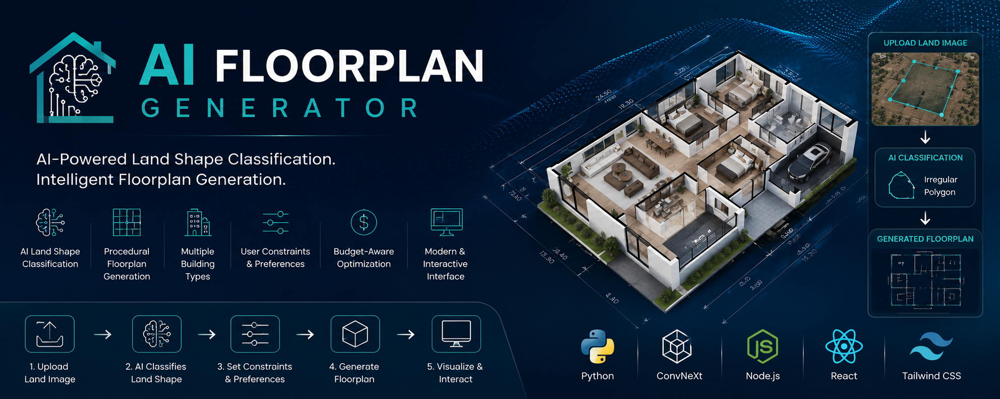

<p align="center">
  
</p>

<h1 align="center">AI Floorplan Generator</h1>

<p align="center">
AI-powered procedural floorplan generation using computer vision, geometry processing, and user-defined constraints.
</p>

<p align="center">


</p>

---

## Overview

AI Floorplan Generator is an intelligent architectural design system that combines **Computer Vision** and **Procedural Generation** to automate the creation of optimized building floorplans.

The system first classifies an uploaded land boundary image using a trained **ConvNeXt** deep learning model. Based on the detected land shape and user-defined constraints—including **building type**, **budget**, and **design preferences**—the backend procedurally generates an optimized floorplan. The generated layout is then presented through a modern **React** web interface.

Unlike traditional floorplan generators, the AI model is responsible for **land shape classification**, while the procedural generation engine constructs the final layout based on architectural rules and user requirements.

---

## Features

- AI-based land shape classification using ConvNeXt
- Procedural floorplan generation
- Support for multiple building types
- Budget-aware layout optimization
- User-defined design constraints
- Geometry-aware room placement
- Interactive React web interface
- Full-stack architecture using React, Node.js, and Python

---

## System Architecture

```text
User Uploads Land Boundary Image
              │
              ▼
      ConvNeXt Shape Classifier
              │
              ▼
       User Constraints
(Building Type • Budget • Preferences)
              │
              ▼
 Procedural Floorplan Generator
              │
              ▼
      Generated Floorplan
              │
              ▼
      React Web Interface
```

---

## Tech Stack

| Category | Technologies |
|----------|--------------|
| Frontend | React, TypeScript, Tailwind CSS |
| Backend | Node.js, Express.js |
| AI | Python, PyTorch, ConvNeXt |
| Geometry Processing | Shapely |
| Version Control | Git, GitHub |

---

## Project Structure

```text
AI-Floorplan-Generator
│
├── backend/
│   ├── AI models
│   ├── API routes
│   ├── Procedural generation engine
│   └── Server
│
├── frontend/
│   ├── React application
│   ├── UI components
│   └── Pages
│
├── assets/
│   └── banner.png
│
├── README.md
├── LICENSE
└── .gitignore
```

---

## Installation

### Clone the repository

```bash
git clone https://github.com/HamzehAlBawaneh/AI-Floorplan-Generator.git
cd AI-Floorplan-Generator
```

### Backend

```bash
cd backend
npm install
```

### Frontend

```bash
cd frontend
npm install
```

### Python Dependencies

Install the required Python packages before running the backend.

---

## Usage

1. Start the backend server.
2. Start the React frontend.
3. Upload a land boundary image.
4. Configure the building type, budget, and other preferences.
5. Generate the optimized floorplan.

---

## Dataset

The dataset used for training and evaluation is available here:

**Google Drive:**  
https://drive.google.com/drive/folders/1a8FXaG5sve1D3Go5lOL4YSJNtwJ_oXNM?usp=sharing

---

## Contributors

- **Hamzeh Al-Bawaneh**
- **Mustafa Al-Kayyali**

---

## License

This project is licensed under the **MIT License**. See the `LICENSE` file for more information.
